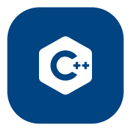

<h1 align="Left">Hi 👋, I'm Iman</h1>
<h3 align="Left">I'm a Master's student in Artificial Intelligence.</h3>

I’m currently working on **Brain-Computer Interfaces (BCI)**

<h3 align="left">Languages and Tools:</h3>

  
  
  
  
  
  
  
  
  
  
  
  
  
  
  

